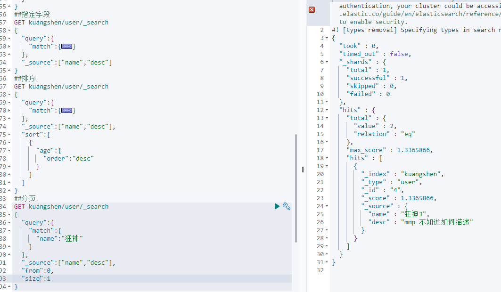

下载es：

    https://www.elastic.co/cn/downloads/elasticsearch
    https://www.elastic.co/cn/downloads/kibana
    kibana和elasticsearch版本要一致

下载es插件：

    数据展示工具
    https://github.com/mobz/elasticsearch-head
    
启动插件

    npm i
    npm start

配置跨域

    在D:\tools\elasticsearch-7.16.2\config中修改elasticsearch.yml
    中添加
    http.cors.enabled: true
    http.cors.allow-origin: "*"

重启后得到下图

默认域名并访问测试

    es:http://127.0.0.1:9200/
    插件：http://127.0.0.1:9100/
    kibana：http://127.0.0.1:5601/app/home#/

汉化kibana：
    
    将文件D:\tools\kibana-7.16.2-windows-x86_64\config的yml文件的配置修改并重启
    此配置对应的是
    D:\tools\kibana-7.16.2-windows-x86_64\x-pack\plugins\translations\translations下的文件

整个启动流程
    
    ES：

    插件：

    kibana：

默认集群名称是

名称解释与DB对比

    索引（index)   相当于数据库
    文档（document)相当于一条条数据
    类型（types)   相当于数据类型

    倒排索引：统计了数据在文档中出现频率进行比对，过滤掉不相关数据 提高过滤效率

    索引
    字段类型
    文档
    分片（documents，Lucene的倒排索引）

IK分词器
    
    https://github.com/medcl/elasticsearch-analysis-ik/releases 下载对应版本
    下载完毕 放入elasticsearch中，然后重启即可

    ik_smart：最少切分（最细粒度，不可能有重复数据）

    ik_max_word:穷尽词库的可能（从字典中去获取）

ik分词器增加自己的配置（解决我们需要的名词）
    
    

基本操作
    
    创建索引
    PUT /索引名/~类型名~/文档ID
    {请求体}

    
    基本数据类型（看官网）
    
    创建具体索引规则

    
    如果文档自动没有指定，es会给我们配置默认的字段类型

    通过GET _cat命令可以获取es的当前很多信息

    修改方法

    删除

    关于文档的操作
    
    基本操作

    

    复杂操作
    分布式全文搜索引擎
    hits：索引和文档的信息，查询的结果总数，然后查询出来的数据都能遍历出来；
          我们可以通过score来判断谁更加符合结果

    must  must_not  should

    filter 添加过滤条件

    多条件根据空格分开（可以通过分值进行基本判断

    精确查询term
    关于分词：
    term：是直接查询精确的
    match：会使用分词器解析！（先分析文档，然后通过分析的文档进行查询）

两个类型

    text：会被分词器解析
    keyword：不会被分词器解析

高亮查询（与自定义标签）

golang的 api文档

    https://www.elastic.co/guide/en/elasticsearch/client/index.html

ES查看机器情况（windows)

    http://127.0.0.1:9201/_cat/nodes?v